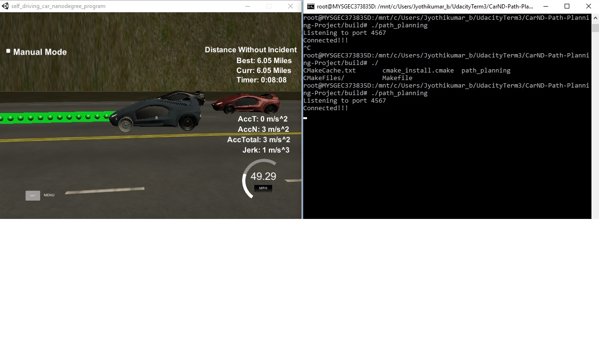

# CarND-Path-Planning-Project
Udacity Self-Driving Car Nanodegree - Path Planning Project


# Overview

In this project, we need to implement an algorithms to calculate the maneuver of the car. We are provided with sensor fusion data and the way points to follow. ([the simulator could be downloaded here](https://github.com/udacity/self-driving-car-sim/releases/tag/T3_v1.2)).

The maneuvar, we calculate should be with the following constraints.[Rubic](https://review.udacity.com/#!/rubrics/1020/view) points
> 1. The car is able to drive at least 4.32 miles without incident
> 2. The car should be drive with in the speed limit
> 3. The car does not exceed a total acceleration of 10 m/s^2 and a jerk of 10 m/s^3
> 4. Car does not have collisions
> 5. The car stays in its lane, except for the time between changing lanes.
> 6. The car is able to change lanes

## Rubic Points

### 1.  The car is able to drive at least 4.32 miles without incident.
I ran the simulator for 6 miles without incident.


### 2. The car should be drive with in the speed limit
Yes, car runs with in the speed limit

### 3. The car does not exceed a total acceleration of 10 m/s^2 and a jerk of 10 m/s^3
Car drives takes only smooth transition (with the help of Spline library). This helps in reducing 

### 4. Car does not have collisions
No collisions.

### 5. The car stays in its lane, except for the time between changing lanes.
Yes, The car stays in its lane most of the time except for the time between changing lanes  / to return to the center lane.

### 6. The car is able to change lanes
If the car ahead of us running at low speed, then our car able to detect the free lane (left/right) and able to take smooth transition.

---

## Reflection

The maneuvour calculated in **Three** steps.

### 1. Prediction of other car path
> a. From sensor fusion data, we are finding the lane position of the detected car 
> ```C
>int car_lane = -1;
>if ( d > 0 && d < 4 ) {
>	car_lane = 0;
>} else if ( d > 4 && d < 8 ) {
>	car_lane = 1;
>} else if ( d > 4 && d < 8 ) {
>	car_lane = 2;
>}
>```

>b. Implementing collisions avoidence system, by sensing the car arround our vehicle.
>```C
>				// Update car flag (collision avoidence)
>                if ( car_lane == lane && !car_ahead ) {
>                  // Car in our lane
>				  if(i_car_s > car_s){
>					  //Ahead of our car
>					  if(i_car_s - car_s < 30){
>						  //i-th car with in 30
>						  car_ahead = true;
>					  }else{
>						  //Don't care 
>						  car_ahead = false;
>					  }
>				  }
>               } else if ( car_lane - lane == -1 && !car_left) {
>                  // Car is in left
>				  if(car_s - 30 < i_car_s && car_s + 30 > i_car_s){
>					  //i-th car is between the collision range
>					  car_left = true;
>				  }else{
>					  // Don't care
>					  car_left = false;
>				  }
>               } else if ( car_lane - lane == 1 && !car_right ) {
>                  // Car is in right
>				  if(car_s - 30 < i_car_s && car_s + 30 > i_car_s){
>					  //i-th car is between the collision range
>					  car_right = true;
>				  }else{
>					  // Don't care
>					  car_right = false;
>				  }
>                }
>```    

So, by the end of prediction module, we will have three updated flag (left,right and ahead). Using those flag we are going to decide our action in next module.

### 2. Decide Behavior of our car
If there is a car in our way, we are trying to pass it on the availability of free space around us. There are situation where we are not able to pass. In those case, we will reduce the speed of the vehicle.

Note : If all three lanes are free, We are trying to run the car in center lane. 
```C
			if ( car_ahead ) { 
			// Car ahead
              if ( !car_left && lane > 0 ) {
                // Change lane left.
                lane--; 
              } else if ( !car_right && lane != 2 ){
                // Change lane right.
                lane++; 
              } else {
				// No option for lane shift. So, reducing the speed
                speed_diff -= MAX_ACC;
              }
            } else if(( lane == 0 && !car_right ) || ( lane == 2 && !car_left ) ) {
				// Back to center.
                lane = 1; 
            }else {
              // Adjust speed to maintain in the MAX_SPEED
              if ( ref_vel < MAX_SPEED ) {
                speed_diff += MAX_ACC;
              }
            }
```
### 3. Trajectory Generation
By the help of spline library, The suggeseted path is created in the simulater. 
